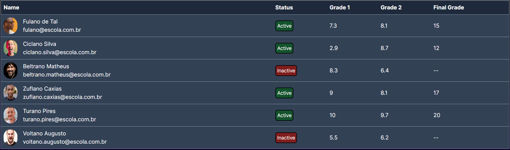

This is a [Next.js](https://nextjs.org/) project bootstrapped with [`create-next-app`](https://github.com/vercel/next.js/tree/canary/packages/create-next-app).

## What is this?

A small study project that consists in creating a student table with informations based on the data file.

### Method

Create a componenet <i style="color: yellow">StudentTable</i> that accepts <i style="color: yellow">students: students[],</i> an array of students as a parameter, it has the same <i style="color: green">Props</i> used in the student data file.
Create a table, and the information of each student is passed with a <i style="color: yellow">students.map()</i>.
Check the files for more details.

### Result

